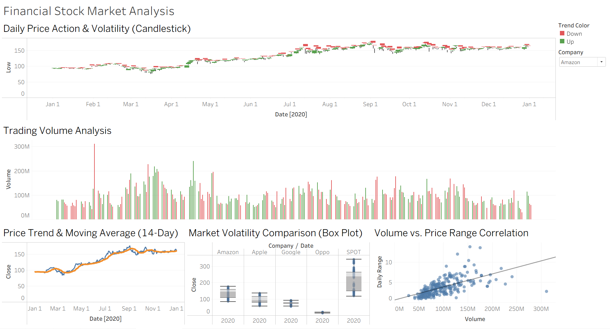

# 📈 Financial Stock Market Analysis Dashboard

## 🎯 Project Overview
A comprehensive and interactive financial dashboard built using Tableau to analyze historical stock market data. The project aims to transform raw datasets into clear, actionable, and structured visual insights, enabling stakeholders to monitor price trends, assess statistical volatility, and discover hidden correlations between trading volumes and price fluctuations.

### 🔗 Live Interactive Dashboard
**[Click Here to View the Dashboard on Tableau Public](https://public.tableau.com/app/profile/osama.hurubi/vizzes)**

## 📊 Key Features & Analytical Approach
The dashboard is structured with a strong emphasis on data governance, accuracy, and clear visual hierarchy:
* **Daily Price Action & Volatility:** Utilizes a Candlestick chart to map Open, High, Low, and Close (OHLC) values accurately.
* **Volume Analysis:** Implements a Bar Chart with dual-color indicators (Up/Down) to track daily trading volumes seamlessly.
* **Price Trend & Moving Average:** Features a Dual-Axis Line Chart applying a 14-day Moving Average to identify market momentum.
* **Market Volatility Comparison:** Employs Box Plots to provide a statistical overview of price distributions and outlier detection across different companies.
* **Volume vs. Price Range Correlation:** Uses a Scatter Plot with trendlines to explore the density and relationship between trading activity and daily price spans.

## 🛠️ Tools & Technologies
* **Data Visualization & Analytics:** Tableau
* **Data Source & Preparation:** Microsoft Excel (`Stock Data.xlsx`)

## 📸 Dashboard Preview

